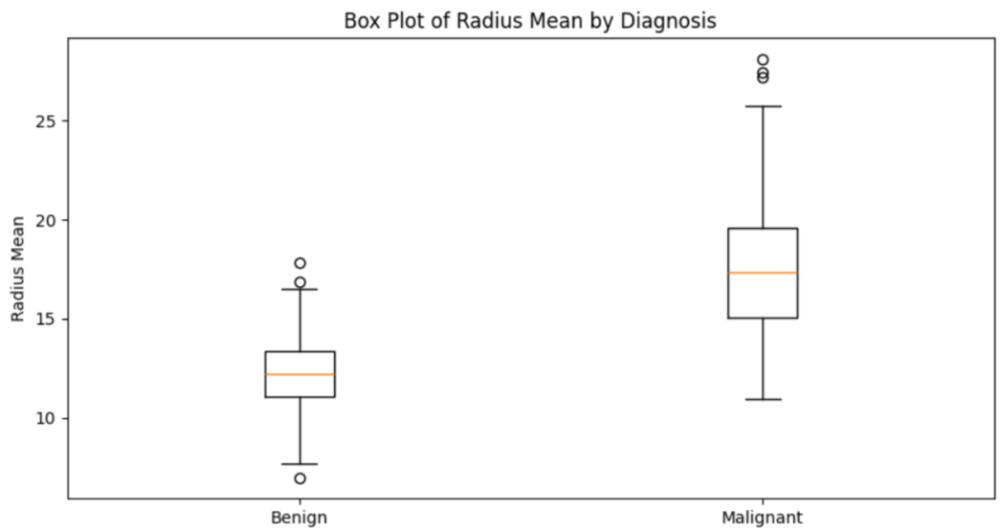
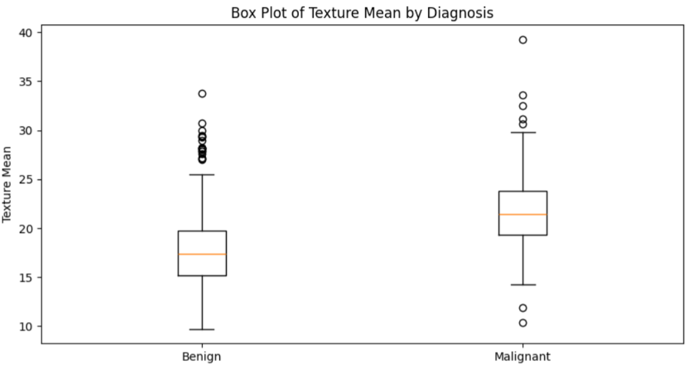

# 🧪 Breast Cancer Tumor Classification:

## 👩‍⚕️ Author

**Your Name**  
**Date:** 12/01/2024

---

## 🧠 What This Project Is About

This project helps us understand if a breast tumor is **malignant (cancerous)** or **benign (not cancerous)** using a method called **logistic regression**. We used a public dataset that includes details measured from tumor images, like size and texture.

---

## 📃 About the Data

- **Source:** [Kaggle - Breast Cancer Wisconsin Dataset](https://www.kaggle.com/datasets/uciml/breast-cancer-wisconsin-data)
- **Data Size:** 569 samples
- **Target:** Whether a tumor is cancerous (M) or not (B)
- **Features:** 30 characteristics like radius, texture, perimeter, etc.

---

## 🧼 Preparing the Data

- Removed unnecessary columns (like IDs).
- Grouped measurements into three types:
  - **Average values**
  - **Standard errors**
  - **Worst-case values**
- Renamed columns to make them easier to understand.
- No missing data
- Converted the target variable Diagnosis from text to numbers:
  - M (Malignant) → 1
  - B (Benign) → 0

---

## 🔍 What Did We Try?

### 🧪 Experiment 1: Just Two Features

We started simple by using only **radius** and **texture** to predict tumor type.

- Achieved about **86% accuracy**.
- Box plots showed clear visual differences between tumor types.
- 🧠 **Conclusion:** In short, the results show that radius and texture are useful for identifying tumor type, although other factors might also improve predictions.

### 📷 Box Plot (PLACEHOLDER)

- 
- 

---

### 🧪 Experiment 2: All Features

We then used a set of carefully selected features—**radius_mean, texture_mean, perimeter_mean, area_mean, and concavity_mean**—to improve the model.

- Our logistic regression model achieved an **accuracy of 87.72%** on the test set.
- These features were effective in distinguishing between malignant and benign cases.
- Histograms of the predicted probabilities showed a **clear separation** between malignant and benign cases.
- 🧠 **Conclusion:** The specific combination of selected features played a significant role in improving the model's performance, indicating that thoughtful feature selection can greatly enhance prediction quality.

### 📷 Accuracy Comparison Chart (PLACEHOLDER)


---

## 📊 Final Thoughts

- Logistic regression is a reliable and interpretable method for classifying tumors.
- Looking at both experiments, we learned that it's not just the number of features that matters, but **which features** are selected and how they're processed.
- **Feature engineering**—the process of selecting, modifying, and transforming variables—played a crucial role in improving model performance.
- The project demonstrates the value of strategic feature selection and thoughtful data preparation in real-world health predictions.

## ✅ Why This Matters

- Fast and accurate predictions can assist doctors in early diagnosis.
- Helps prioritize which patients need more attention.

---

## 🛠️ How to Use This Notebook

1. Download the file and open it with **Jupyter Notebook**.
2. Install needed tools by running:
   ```bash
   pip install pandas numpy matplotlib scikit-learn ucimlrepo
   ```
3. Follow the notebook step by step.

---

## 📝 License

This project is open-source and available under the MIT License.
